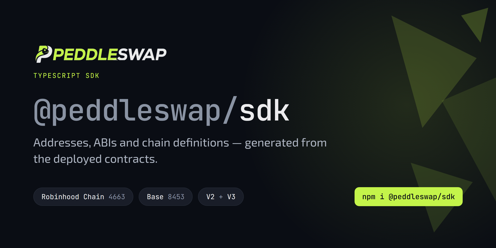

<p align="center">
  <a href="https://peddleswap.xyz"></a>
</p>

# @peddleswap/sdk

Addresses, ABIs and chain definitions for [PeddleSwap](https://peddleswap.xyz): swap,
earn from liquidity, and lock tokens on Robinhood Chain and Base.

**[Website](https://peddleswap.xyz)** · **[Docs](https://docs.peddleswap.xyz)** ·
**[Testnet](https://testnet.peddleswap.xyz)** · **[Brand kit](https://peddleswap.xyz/brand)** ·
**[Integrate with Claude](./CLAUDE-PROMPT.md)**

## What PeddleSwap does

| | What it is | Contracts in this SDK |
|---|---|---|
| **Swap** | Trade any two tokens at the best price across PeddleSwap's pools | `swapRouter02`, `quoterV2`, `mixedRouteQuoter`, `v2Router` |
| **Pools** | Uniswap V2 pairs and V3 concentrated-liquidity pools; LPs earn every trade's fee | `v2Factory`, `v3Factory`, `positionManager`, `v3PoolDeployer` |
| **Dynamic fees** | V3 pools can adjust their fee per swap | `dynamicFeeModule` |
| **Locker** | Lock tokens or LP positions until a date you choose, with a public proof | `lockerERC20`, `lockerERC721`, `v3FeeAdapter` |
| **Launchpad** | Create a token, open its market and lock the liquidity in one go (Robinhood Chain) | `tokenFactory` |
| **Limit orders** | Buy or sell at a price you set (Base) | `limitOrders` |
| **Fees** | Protocol, referral and creator fees on swaps | `feeRouter` |

## Deployments

| Chain | Id | Deployed at block | Explorer |
|---|---|---|---|
| Robinhood Chain | `4663` | `61044184` | [robin.etherscan.io](https://robin.etherscan.io) |
| Base | `8453` | `51852486` | [basescan.org](https://basescan.org) |
| Sepolia (testnet) | `11155111` | `11680694` | [sepolia.etherscan.io](https://sepolia.etherscan.io) |

Everything is generated from the contracts repo's own build output — addresses from the
deploy broadcast's record, ABIs from solc, CREATE2 init code hashes from the deployed
creation bytecode. Nothing is transcribed by hand, so nothing here can drift from the
chain without the build failing.

```sh
npm install @peddleswap/sdk viem
```

`viem` is a peer dependency; bring your own so you don't end up with two copies.

Three chains ship addresses: Robinhood Chain (`4663`), Base (`8453`) and Sepolia
(`11155111`). Base has no launchpad (`tokenFactory`): token launches on Base are Latch
Protocol's. Anubis Chain (`6714`) is **registered but not yet deployed**: its viem
definition ships in `chains` (and as `anubis`) so you can build a client for it, but
`addresses` has no entry and `isSupportedChain(6714)` returns `false` until its contracts
are live and a new version is published.

## Integrating with Claude

[`CLAUDE-PROMPT.md`](./CLAUDE-PROMPT.md) is a ready-made prompt: paste it into Claude with
one line describing what you are building, and it integrates PeddleSwap across every
deployed chain, with the PeddleSwap-specific traps (the V3 pool deployer, per-chain
contracts, the locker fee) already covered.

## Quick start

```ts
import { createPublicClient, http } from "viem";
import { addresses, chains, quoterV2Abi } from "@peddleswap/sdk";

const client = createPublicClient({ chain: chains[4663], transport: http() });

const { result } = await client.simulateContract({
  address: addresses[4663].quoterV2,
  abi: quoterV2Abi,
  functionName: "quoteExactInputSingle",
  args: [{
    tokenIn: addresses[4663].weth9,
    tokenOut: "0x5fc5360D0400a0Fd4f2af552ADD042D716F1d168", // USDG
    amountIn: 10n ** 18n,
    fee: 3000,
    sqrtPriceLimitX96: 0n,
  }],
});
```

`QuoterV2` reverts to return its answer, so it is called with `simulateContract`, not
`readContract`. That is Uniswap's design, not a quirk of this package.

## Pool addresses

Pool addresses are pure functions of the tokens and the fee, so compute them instead of
asking the chain. This works for a pool that does not exist yet, which is what you need
when quoting a first deposit.

```ts
import { computeV3PoolAddress, computeV2PairAddress, FEE_TIERS } from "@peddleswap/sdk";

computeV3PoolAddress(4663, tokenA, tokenB, 3000); // argument order does not matter
computeV2PairAddress(4663, tokenA, tokenB);
```

### If you are deriving addresses yourself, read this

**PeddleSwap V3 salts its pools against the pool deployer, not the factory.** The factory
would exceed the contract size limit if it carried the pool creation code, so a separate
`PeddleSwapV3PoolDeployer` does the deploying. Upstream Uniswap V3 uses the factory, and
so does every tutorial and helper library you will find.

Using the factory does not throw. You get a well-formed address that no contract was ever
deployed to, and the failure shows up much later as reads returning zeroes or a swap
reverting for no visible reason. `computeV3PoolAddress` handles this; the raw pieces are
exported if you need them:

```ts
import { addresses, initCodeHashes } from "@peddleswap/sdk";

addresses[4663].v3PoolDeployer; // the CREATE2 deployer for V3 pools
addresses[4663].v3Factory;      // NOT the CREATE2 deployer
initCodeHashes.v3Pool;          // keccak256 of the pool creation bytecode
```

V2 is the ordinary case: its factory deploys its own pairs, so pairs salt against
`v2Factory` with `initCodeHashes.v2Pair`.

The V3 salt is `abi.encode(token0, token1, fee)` — padded, 96 bytes. The V2 salt is
`abi.encodePacked(token0, token1)` — 40 bytes. They are not interchangeable.

## Fee tiers

All four are enabled on every chain, verified against the live factories:

| Fee | Tier | Tick spacing |
|---|---|---|
| `100` | 0.01% | 1 |
| `500` | 0.05% | 10 |
| `3000` | 0.30% | 60 |
| `10000` | 1.00% | 200 |

```ts
import { FEE_TIERS, tickSpacings } from "@peddleswap/sdk";
```

## Contracts that exist on one chain and not the other

The deployments are not identical, and the address map is typed per chain to match.
Limit orders are on Base and Sepolia; the launchpad (`tokenFactory`) is on Robinhood Chain
and Sepolia; the launchpad fee splitter is on Sepolia only:

```ts
addresses[8453].limitOrders;  // fine
addresses[4663].limitOrders;  // compile error — not deployed there
addresses[8453].tokenFactory; // compile error — Base launches are Latch Protocol's
```

That is deliberate. A flat `Record<string, Address>` would let the second line compile and
hand back `undefined`, which in a transaction builder becomes an approval or a fill sent to
the zero address. Better a red squiggle than a lost transaction.

The catch is that `addresses[chainId]` does not compile when `chainId: number` — which is
exactly what `useChainId()` and every wallet event give you. Narrow it rather than casting:

```ts
import { addresses, isSupportedChain } from "@peddleswap/sdk";

if (!isSupportedChain(chainId)) return null;   // chainId is now 4663 | 8453 | 11155111
const router = addresses[chainId].swapRouter02;
```

`addresses[chainId as SupportedChainId]` compiles too, and puts back the exact hole the
typing closed — on an unsupported chain it yields `undefined` and the next read throws.

Superseded contracts are **not** published here. Sepolia's deploy record keeps a
`lockerERC721Legacy` address, because the lockers have no proxy and no admin unlock by
design — a replaced locker keeps custody of what was locked in it forever, so that address
is the only record of where those assets are. It is omitted from this package because the
ABI shipped here does not decode it: that contract predates the `collectFeeBps` field, so
its `getLock` returns six words where `lockerERC721Abi` declares seven. Migration across a
supersession is application logic and needs an ABI this package cannot vouch for.

## Indexing Robinhood Chain

Two things will cost you a day if nobody tells you.

**`block.number` inside a contract is not the same numbering space as `eth_blockNumber`
and `eth_getLogs`.** They sit roughly 35 million apart on chain 4663. Range log queries
against `eth_blockNumber`; never against a block number read out of a contract.
`deploymentBlock[4663]` is in the `eth_blockNumber` space, which is the one you want for a
backfill.

**Not every public endpoint serves a wide `eth_getLogs`.** All seven in
`chains[4663].rpcUrls` answer `eth_call`; `robinhood.drpc.org` failed every attempt at a
5000-block log range when each was measured three times, so it is ordered last. The list
is in measured order, not alphabetical.

## What's exported

- `addresses`, `SupportedChainId`, `AddressesFor` — per-chain, typed
- `chains`, `robinhood`, `sepolia`, `base`, `anubis`, `deploymentBlock` — viem chain
  definitions (`chains` also carries the registered-but-undeployed Anubis)
- `supportedChainIds`, `isSupportedChain` — narrowing a plain `number`
- `computeV3PoolAddress`, `computeV2PairAddress`, `sortTokens` — CREATE2 derivation
- `FEE_TIERS`, `tickSpacings`, `FeeAmount`
- `initCodeHashes`
- 25 ABIs, each `as const` so viem infers argument and return types — one for **every**
  address the package ships, which is asserted by a test rather than left to judgement:
  `v2FactoryAbi`, `v2RouterAbi`, `v2PairAbi`, `v3FactoryAbi`, `v3PoolAbi`,
  `v3PoolDeployerAbi`, `swapRouterAbi`, `swapRouter02Abi`, `positionManagerAbi`,
  `quoterAbi`, `quoterV2Abi`, `mixedRouteQuoterAbi`, `tickLensAbi`, `tokenValidatorAbi`,
  `interfaceMulticallAbi`, `dynamicFeeModuleAbi`, `lockerERC20Abi`, `lockerERC721Abi`,
  `feeRouterAbi`, `tokenFactoryAbi`, `tokenDescriptorAbi`, `v3FeeAdapterAbi`,
  `limitOrdersAbi`, `launchpadFeeAbi`, `weth9Abi`

Reads batch through Multicall3 on every chain — the chain objects declare it, so viem
folds a page of pool reads into one round trip without any setup.

## Verification

All 20 mainnet contracts are verified on Sourcify:
`https://sourcify.dev/server/v2/contract/4663/<address>`.

## Where this code lives

This package is developed in the PeddleSwap monorepo (private) at `packages/sdk`, and
published here, in [`peddleswap/core-sdk`](https://github.com/peddleswap/core-sdk).

**If you are reading this in `core-sdk`, that is the mirror.** It is a read-only
projection, force-pushed on every change, so a commit made directly here is destroyed by
the next sync. Issues are welcome here; changes are made in the monorepo, where
`packages/sdk` sits next to the contracts it is generated from.

The split exists because of that generation. Addresses and ABIs are derived from
`contracts/`, which cannot be done from a standalone checkout — so the monorepo is the
source of truth, and the mirror is here so you can read, clone and `npm install` the
package without pulling a DEX, an indexer and a Next.js app alongside it.

`src/generated` is committed precisely so the mirror still builds, typechecks and tests on
its own.

## Development

```sh
npm install
npm run gen        # regenerate src/generated from ../../contracts
npm run gen:check  # regenerate and fail if anything moved (what CI runs)
npm run build
npm test
```

In the monorepo, `npm run gen` reads `../../contracts/out` and
`../../contracts/deployments`, so `forge build` must have been run in `contracts/` first.

In the mirror there is no `contracts/` and there cannot be. `npm run gen` detects that,
says so, and leaves the committed files alone; `npm test` reports **28 passed, 2 skipped**,
the two skips being the init-code-hash comparisons that have no Solidity to read. They are
skipped rather than passed, because a green result for a check that did not happen would
be a lie.

Release and mirroring instructions are in [PUBLISHING.md](./PUBLISHING.md).

### Adding a chain after its deploy

Anubis (`6714`) is listed in `CHAINS` in `scripts/generate.mjs` with `pending: true`
(Base went through these steps on 2026-09-27): a missing `contracts/deployments/<id>.json` is skipped with a notice
rather than failing the build. Once the deploy has written that record:

1. `npm run gen` — the chain appears in `src/generated/addresses.ts` on its own, and
   `supportedChainIds` / `isSupportedChain` follow because they derive from it.
2. Add its entry to `deploymentBlock` in `src/chains.ts`. `npm run typecheck` fails until
   you do (`satisfies Record<SupportedChainId, bigint>`). Take the block of the earliest
   CREATE from `contracts/broadcast/Deploy.s.sol/<id>/`, not blindly the record's
   `deployBlock` — see the Sepolia note there for why the two can differ.
3. Update the chain lists asserted in `src/addresses.test.ts` ("ships every deployed chain", the
   `supportedChainIds` expectation, and the "registers Anubis" test), then `npm test`.
4. `npm run verify:live -- <id>` against the live chain, and `npm run gen:check`.
5. Remove `pending: true` for that chain in `scripts/generate.mjs`, so a record that later
   goes missing fails the build instead of silently dropping the chain.
6. Update the chain table at the top of this README and the package description.

**Locker ABIs note.** `lockerERC20Abi` / `lockerERC721Abi` are generated from the current
sources, which added `feeToken()`, a `_feeToken` constructor argument and the
`NativeFeeNotAccepted` error. The lockers already deployed on `4663` and `11155111`
predate that: `feeToken()` reverts on them (checked 2026-09-24). Every other function in
the ABI is unchanged, so existing reads still decode; just do not call `feeToken()` on
those two chains.

`npm run verify:live` checks every shipped address against the live chain using the ABI
shipped for it, and asserts the cross-references agree — `v2Router.factory()` must equal
`addresses[id].v2Factory`, and so on for all nine periphery contracts. That is the check
that catches a deployment record listing a router from one deploy beside a factory from
another: both addresses hold real working contracts, every ABI matches, quotes still come
back, and they are quotes from a different exchange than the one you pointed at. 29 checks on
Robinhood Chain and 33 on Sepolia, all currently passing. It needs network access, so it is a command rather than
a test — a unit test that fails on a bad RPC minute teaches people to ignore failures.

The tests are cross-checks, not self-checks. `pool.test.ts` compares the derivation
against vectors produced by `contracts/script/PrintPoolAddresses.s.sol`, which mirrors the
Solidity the routers run. `initCodeHash.test.ts` reads the hardcoded constants back out of
`PeddleSwapV2Library.sol` and `PoolAddress.sol` and asserts the generated values still
match — so if the pair or pool bytecode ever moves without those literals being updated,
this package's build is what catches it.

## License

This package is MIT. The contracts it describes are not: per `docs/adr/0001-fork-strategy.md`
the V2 sources are GPL-3.0 and the V3 sources GPL-2.0-or-later, inherited from the Uniswap
code they fork.

The split is deliberate and follows the upstream precedent exactly — Uniswap publishes
`@uniswap/v3-sdk` under MIT against a BUSL-1.1 core, and `@uniswap/v2-sdk` under MIT
against a GPL-3.0 core. What ships here is an interface description (ABIs, addresses, and
CREATE2 arithmetic), not contract source, and it carries no compiled contract code. If you
vendor or modify the contracts themselves, their licenses govern that, not this one.
